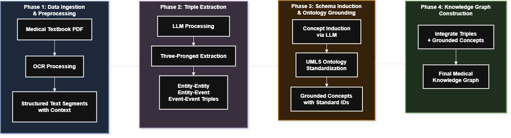

# Medical-SchemaKG Framework

A Python prototype framework for building ontology-grounded medical knowledge graphs from text using LLM-based extraction.

## Overview

The Medical-SchemaKG Framework implements a four-phase pipeline to construct knowledge graphs from medical text documents:



1. **Phase 1: Document Ingestion & Preprocessing**
2. **Phase 2: Triple Extraction**
3. **Phase 3: Hybrid Schema Induction & Ontology Grounding**
4. **Phase 4: Knowledge Graph Construction**

## Architecture

### Core Data Concepts

- **Triple**: Basic unit of knowledge as (Head, Relation, Tail)
  - **Entity-Entity (E-E)**: Links two static entities (e.g., Metformin treats Type 2 Diabetes)
  - **Entity-Event (E-Ev)**: Links entity to event (e.g., Patient participated_in Clinical Trial)
  - **Event-Event (Ev-Ev)**: Links two events (e.g., Diagnosis led_to Treatment)

- **Entity Node**: Represents static things (drugs, symptoms, diseases)
- **Event Node**: Represents actions or occurrences
- **Concept Node**: Abstract category from LLM analysis
- **Grounded Concept Node**: Standardized concept with ontology ID (UMLS/SNOMED CT)

### Pipeline Flow

```
Medical Text → Segmentation → Triple Extraction → Schema Induction → Ontology Grounding → Knowledge Graph
```

## Installation

### Prerequisites

- Python 3.8 or higher
- pip package manager
- Internet connection (for dataset download)

### Setup

1. Clone or download this repository

```bash
git clone https://github.com/gadu04/Medical-SchemaKG
```

2. Install required dependencies:

```bash
pip install -r requirements.txt
```

3. Download required dataset:

```bash
python install_dataset.py
```

This step will automatically download all required input data into the `data/` directory.

4. Set up LM Studio API:

```bash
# Windows PowerShell
$env:LM_STUDIO_BASE_URL="http://localhost:1234/v1"
$env:MODEL_NAME="local-model"

# Linux/Mac
export LM_STUDIO_BASE_URL="http://localhost:1234/v1"
export MODEL_NAME="local-model"
```


## Usage

### Quick Start

#### Step 1: Run the main pipeline (Knowledge Graph construction)

Run the framework:

```bash
python main.py
```

This step will:
- Load or create sample medical text
- Extract triples using LLM API calls
- Induce concepts and ground them to ontologies
- Construct the knowledge graph in file-based formats
- Generate visualizations and reports in the `output/` directory

---

### Step 2: Start Neo4j using Docker Compose
Neo4j is deployed using Docker. Before pushing the knowledge graph, make sure the Neo4j service is running:

```bash
docker compose up -d
```

This step will:
- Start the Neo4j database container
- Expose Neo4j services (Bolt / Browser)
- Prepare the graph database for data ingestion

> ⚠️ Ensure Docker and Docker Compose are installed and running.
#### Step 3: Push the Knowledge Graph into Neo4j

After `main.py` finishes, run the Neo4j export script:

```bash
python pipeline/kg_build.py
```

This step will:
- Load the generated knowledge graph from the `output/` directory
- Convert nodes and edges into Neo4j-compatible representations
- Create nodes, relationships, and properties in Neo4j
- Enable graph querying and downstream reasoning using Cypher

>  **Important**: Ensure that the Neo4j service is running before executing this step.

---

### Notes

- `main.py` builds the knowledge graph but **does not persist it to Neo4j**
- `kg_build.py` is responsible for **graph persistence and database population**
- Neo4j must be running via Docker Compose before executing `kg_build.py`
- You can re-run `kg_build.py` independently without re-running the entire pipeline
- Neo4j is used as the backend graph store for downstream evaluation and reasoning (e.g.  Think-on-Graph, LLM-based querying)


### Using Real LLM API

To configure LM Studio:

```bash
# Set environment variables
$env:LM_STUDIO_BASE_URL="http://localhost:1234/v1"
$env:MODEL_NAME="local-model"

# Run the framework
python main.py
```

### Custom Input

Place your medical text file in `data/sample_medical_text.txt` or modify the `input_file` path in `main.py`.

## Project Structure

```
Framework/
├── main.py                          # Main orchestrator
├── install_dataset.py               # Dataset download & setup script
├── pipeline/
│   ├── __init__.py
│   ├── phase_1_ingestion.py         # Phase 1: Document loading
│   ├── phase_2_triple_extraction.py # Phase 2: Triple extraction
│   ├── phase_3_schema_induction.py  # Phase 3: Concept induction
│   ├── phase_4_kg_construction.py   # Phase 4: Graph building
│   ├── kg_build.py                  # Low-level KG construction utilities
│   └── umls_loader.py               # UMLS ontology loading & concept mapping
├── llm_api/
│   ├── __init__.py
│   ├── interface.py                 # API interface
│   └── real_api.py                  # LM Studio API implementation
├── evaluate/
│   ├── BERTScore_eval.py            # BERTScore-based KG/text evaluation
│   ├── Think_on_Graph.py            # Think-on-Graph reasoning evaluation
│   ├── ToG_LLM_eval.py              # LLM-based ToG evaluation
│   └── llm_direct.py                # Direct LLM baseline evaluation
├── utils/
│   ├── __init__.py
│   └── visualization.py             # Visualization and reporting
├── data/
│   └── sample_medical_text.txt      # Sample input (auto-generated or downloaded)
├── output/
│   ├── knowledge_graph.png          # Graph visualization
│   ├── knowledge_graph.json         # Graph in JSON format
│   └── knowledge_graph.graphml      # Graph in GraphML format
├── requirements.txt
└── README.md

```

## Module Descriptions

### Phase 1: Document Ingestion

**File**: `pipeline/phase_1_ingestion.py`

**Status**: Implemented

**Function**: Handles OCR and text preprocessing by reading `.txt` files and segmenting them into paragraphs.

### Phase 2: Triple Extraction

**File**: `pipeline/phase_2_triple_extraction.py`

**Status**: Implemented

**Function**: Extracts three types of triples (E-E, E-Ev, Ev-Ev) from text segments using LLM API. Collects all unique nodes for downstream processing.

**Key Class**: `TripleExtractor`

### Phase 3: Schema Induction & Grounding

**File**: `pipeline/phase_3_schema_induction.py`

**Status**: Implemented

**Functions**:
- `dynamically_induce_concepts()`: Uses LLM to generate abstract concepts
- `ground_concepts_to_ontology()`: Maps concepts to UMLS/SNOMED CT

### Phase 4: Knowledge Graph Construction

**File**: `pipeline/phase_4_kg_construction.py`

**Status**: Implemented

**Function**: Builds NetworkX MultiDiGraph from triples and grounded nodes. Adds rich metadata and attributes to nodes and edges.

**Key Function**: `build_knowledge_graph()`

### LLM API Interface

**Files**: `llm_api/interface.py`, `llm_api/real_api.py`

**Functions**:
- Implements detailed prompts for triple extraction and concept induction
- Uses local LM Studio for LLM inference
- Enforces structured JSON output format

## Configuration

The framework is fully configurable via environment variables in the `.env` file.

### Setup Configuration File

1. Copy the example file:
   ```bash
   cp .env.example .env
   ```

2. Edit `.env` with your settings

### Environment Variables

#### LLM Configuration
- `USE_REAL_LLM`: Set to `true` to use LM Studio (default: `true`)
- `LM_STUDIO_BASE_URL`: LM Studio API URL (default: `http://localhost:1234/v1`)
- `MODEL_NAME`: LLM model name in LM Studio (default: `local-model`)
- `MODEL_TEMPERATURE`: Model temperature 0.0-1.0 (default: `0.1`)
- `MODEL_MAX_TOKENS`: Maximum response tokens (default: `2000`)

#### File Path Configuration
- `INPUT_FILE`: Path to input text file (default: `data/sample_medical_text.txt`)
- `OUTPUT_DIR`: Directory for output files (default: `output`)

### Example .env Configuration

```ini
# Use LM Studio
USE_REAL_LLM=true
LM_STUDIO_BASE_URL=http://localhost:1234/v1

# Model settings
MODEL_NAME=local-model
MODEL_TEMPERATURE=0.1
MODEL_MAX_TOKENS=2000

# File paths
INPUT_FILE=data/sample_medical_text.txt
OUTPUT_DIR=output
```

### Quick Configuration Options

**Option 1: Use LM Studio with Custom Model**
```ini
USE_REAL_LLM=true
LM_STUDIO_BASE_URL=http://localhost:1234/v1
MODEL_NAME=your-model-name
MODEL_TEMPERATURE=0.2
```

**Option 2: Custom Input/Output Paths**
```ini
INPUT_FILE=data/my_medical_notes.txt
OUTPUT_DIR=results
```

## Output Files

After execution, the following files are generated in the `output/` directory:

1. **knowledge_graph.png**: Visual representation of the knowledge graph
2. **knowledge_graph.json**: Graph in JSON format for web visualization
3. **knowledge_graph.graphml**: Graph in GraphML format for analysis tools
4. **knowledge_graph_edges.txt**: Simple edge list format


## Based On

This framework implements concepts from:
- **AutoSchemaKG**: Automatic Schema Induction for Knowledge Graphs
- Medical knowledge extraction methodologies
- Hybrid ontology grounding approaches

## License

This is a prototype framework for educational and research purposes.

## Contact

For questions or issues, please refer to the project documentation or contact the development team.
